# Modelado As-Is cuestionario LP

Autor: Kriptobal

## ¿Qué es modelado orientado a objetos?

Es una herramienta de modelado conceptual que hace una sintesis entre los datos y procesos, ideal para ser aplicada al software.
{style="display: block; margin: 0 auto;width: 300px; height: 200px;"}

## Utilidad

Las areas beneficiadas con MOO:

1. Implementacion (mas facil implementar patrones de software).
2. Implementacion (El software es de mayor calidad).
3. Requisitos (Se definen mejor los requisitos).
4. Pruebas (Hay claridad de donde probar cada cosa).
5. Etc...

## Contexto del ejemplo

A continuacion se muestra un ejemplo que pretende mostrar los beneficios del MOO en un software familiar para los integrantes. Y la idea es que para las proximas piezas hechas para la web se haga antes este modelo para tener un mejor proyecto. Tambien se puede usar el siguiente ejemplo a modo de documentacion, si es que el MOO se aplica en el proyecto. 

## Ejemplo de modelado para el cuestionario

A traves del codigo y sus estructuras de datos de logro extraer el funcionamiento del programa que estaba estructurado proceduralmente, y se modelo a modo de ejemplo como quedaria si se hubiese modelado con MOO y ademas se definio el actor de uso, el contexto del caso de uso y los diferentes casos de uso para el actor.

## Actor
Se tiene un modelo del usuario para definir las cosas que puede hacer:
{style="display: block; margin: 0 auto;width: 300px; height: 200px;"}

## Contexto caso de uso
Vista general del flujo del programa sirve para orientar los casos particulares:
Nota: los elementos circulares se usan para denotar eventos y el verde que dice **Init** es para indicar **Inicio del programa** y el rojo que dice **Kill** es para indicar **Fin del programa**, mientras que el verde que dice **Start** es para indicar **inicio del caso particular** y el rojo que dice **End** es para indicar **fin del caso particular**

{style="display: block; margin: 0 auto; width: 400px;"}

### Caso particular: Configurar evaluacion 📝

{style="display: block; margin: 0 auto; width: 250px;"}

### Caso particular: Rendir evaluacion ✍🏻

{style="display: block; margin: 0 auto; width: 350px;"}

### Caso particular: Ver resultados ❔

{style="display: block; margin: 0 auto; width: 200px;"}

### Modelo orientado a objetos

Anterior mente se mostro el flujo para un actor por todo el cuestionario, pero ahora es momento de tomar eso y hacer una estructura con relaciones que nos permita acercar ese proceso a los datos.

### Modelo orientado a objetos

{style="display: block; margin: 0 auto;width: 100%; height: 100%;"}

### Conclusiones

Como se vio se obtuvieron los siguientes beneficios despues de aplicar el modelado:

1. Simplificaciones de estructuras: se redujo la cantidad de casos particulares implementando el objeto evaluaciones, permitiendo compartir cosas comunes entre certamenes y quizes.
2. Cercania al modelo de datos: Podemos ahora pasar del sistema de ficheros a objetos y dar un salto mas facil hacia una base de datos.
3. Extensibilidad: El codigo ahora es mucho mas facil de extender ya que esta modularizado.

### Propuesta

El metodo de trabajo seria modelar, luego implementar. Pero hay que definir roles y tareas. Ideal saber los requisitos desde el principio y apegarse a eso.

