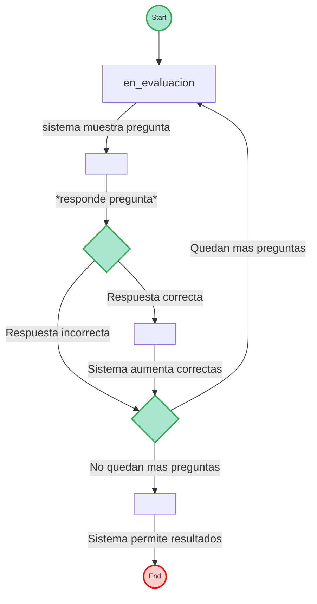

```mermaid
flowchart TD
    id1((Start)):::smallGreenCircle --> id2[en_evaluacion]
    id9((End)):::smallRedCircle
    id3[ ]
    id2 --> |sistema muestra pregunta|id3 
    id4{ }:::decision
    id3 --> |*responde pregunta*|id4
    id5[ ]
    id7[ ]
    id8{ }:::decision
    id4 --> |Respuesta correcta|id5
    id4 --> |Respuesta incorrecta|id8
    id5 --> |Sistema aumenta correctas|id8
    id8 --> |Quedan mas preguntas| id2
    id8 --> |No quedan mas preguntas| id7
    id7 --> |Sistema permite resultados|id9
    
    

    %% Definir estilo personalizado para el círculo (Start)
    classDef smallGreenCircle fill:#a8e6cf,stroke:#34a853,stroke-width:2px,font-size:10px,radius:10px;
    
    %% Definir estilo personalizado para la caja de decisión (más proporcionada)
    classDef decision fill:#a8e6cf,stroke:#34a853,stroke-width:2px,font-size:12px,padding:10px;

    %% Definir estilo personalizado para el círculo (End)
    classDef smallRedCircle fill:#ffcccc,stroke:#ff0000,stroke-width:2px,font-size:10px,radius:10px;
```