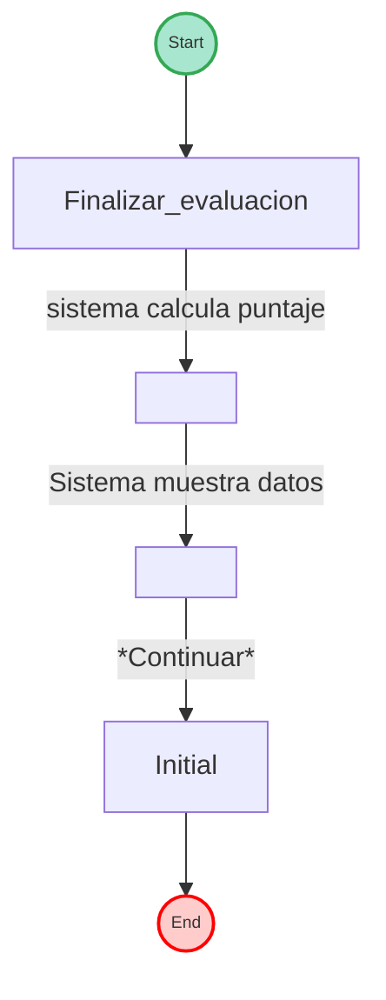

```mermaid
flowchart TD
    id1((Start)):::smallGreenCircle --> id2[Finalizar_evaluacion]
    id9((End)):::smallRedCircle
    id3[ ]
    id2 --> |sistema calcula puntaje|id3 
    id4[Initial]
    id5[ ]
    id3 --> |Sistema muestra datos|id5
    id4 --> id9
    id5 --> |*Continuar*|id4

    
    %% Definir estilo personalizado para el círculo (Start)
    classDef smallGreenCircle fill:#a8e6cf,stroke:#34a853,stroke-width:2px,font-size:10px,radius:10px;
    

    %% Definir estilo personalizado para el círculo (End)
    classDef smallRedCircle fill:#ffcccc,stroke:#ff0000,stroke-width:2px,font-size:10px,radius:10px;
```