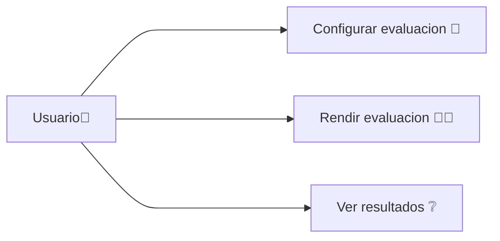

```mermaid
flowchart LR
    customer[Usuario👤]
    action1[Configurar evaluacion 📝]
    action2[Rendir evaluacion ✍🏻]
    action3[Ver resultados ❔]
    

    customer----->action1
    customer----->action2
    customer----->action3
```