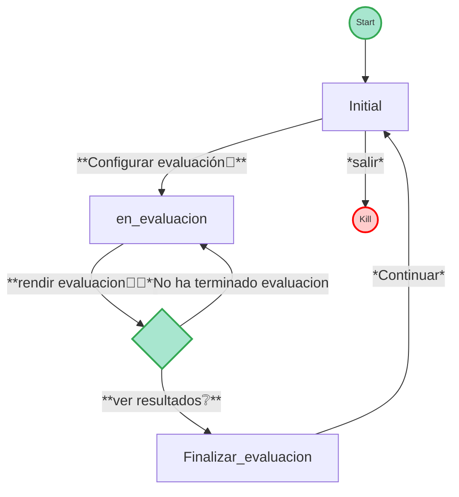

```mermaid
flowchart TD
    id1((Start)):::smallGreenCircle --> id2[Initial]
    id2 -->|**Configurar evaluación📝**| en_evaluacion --> |**rendir evaluacion✍🏻**| id3
    id2 --> |*salir*|id4((Kill)):::smallRedCircle
    id3{ }:::decision
    id3 --> |No ha terminado evaluacion| en_evaluacion
    id3 --> |**ver resultados❔**|Finalizar_evaluacion
    Finalizar_evaluacion --> |*Continuar*| id2


    %% Definir estilo personalizado para el círculo (Start)
    classDef smallGreenCircle fill:#a8e6cf,stroke:#34a853,stroke-width:2px,font-size:10px,radius:10px;
    
    %% Definir estilo personalizado para la caja de decisión (más proporcionada)
    classDef decision fill:#a8e6cf,stroke:#34a853,stroke-width:2px,font-size:12px,padding:10px;

    %% Definir estilo personalizado para el círculo (End)
    classDef smallRedCircle fill:#ffcccc,stroke:#ff0000,stroke-width:2px,font-size:10px,radius:10px;
```