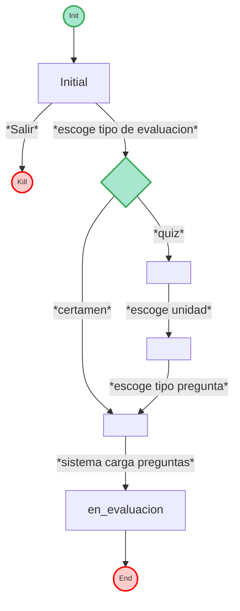

```mermaid
flowchart TD
    id1((Init)):::smallGreenCircle --> id2[Initial]
    id9((End)):::smallRedCircle
    id10((Kill)):::smallRedCircle
    id2 -->|*escoge tipo de evaluacion*| id4
    id2 --> |*Salir*|id10
    id3[ ]
    id4{ }:::decision
    id4 --> |*quiz*| id3
    id4 --> |*certamen*|id7
    id6[ ]
    id7[ ]
    id8[en_evaluacion ]
    id3 --> |*escoge unidad*|id6
    id6 --> |*escoge tipo pregunta*| id7
    id7 --> |*sistema carga preguntas*| id8
    id8 --> id9
    

    %% Definir estilo personalizado para el círculo (Start)
    classDef smallGreenCircle fill:#a8e6cf,stroke:#34a853,stroke-width:2px,font-size:10px,radius:10px;
    
    %% Definir estilo personalizado para la caja de decisión (más proporcionada)
    classDef decision fill:#a8e6cf,stroke:#34a853,stroke-width:2px,font-size:12px,padding:10px;

    %% Definir estilo personalizado para el círculo (End)
    classDef smallRedCircle fill:#ffcccc,stroke:#ff0000,stroke-width:2px,font-size:10px,radius:10px;
```