# Modelado To-Be cuestionario LP

Autor: Kriptobal

## ¿Qué es modelado orientado a objetos?

Es una herramienta de modelado conceptual que hace una sintesis entre los datos y procesos, ideal para ser aplicada al software.
{style="display: block; margin: 0 auto;width: 300px; height: 200px;"}

## Utilidad

Las areas beneficiadas con MOO:

1. Implementacion (mas facil implementar patrones de software).
2. Implementacion (El software es de mayor calidad).
3. Requisitos (Se definen mejor los requisitos).
4. Pruebas (Hay claridad de donde probar cada cosa).
5. Etc...

## Contexto del ejemplo

El diseno actual es una extension de lo realizado previamente en el modelado as-is. Donde proponemos segun lo planteado en los requisitos funcionales una estructura mas flexible, escalable y mantenible en el tiempo. Esta estructura debe ser implementada en el codigo React y Github pages, tambien este proyecto esta sujeto a cambios durante las fases siguientes si asi lo requieren.

## Ejemplo de modelado para el cuestionario

Manteniendo todas las funcionalidades del cuestionario hemos agregado la opcion para realizarlos con tiempo en el caso de los certamenes y quizes.

## Actor
Se tiene un modelo del usuario para definir las cosas que puede hacer:
{style="display: block; margin: 0 auto;width: 300px; height: 200px;"}

## Contexto caso de uso
Vista general del flujo del programa sirve para orientar los casos particulares:
Nota: los elementos circulares se usan para denotar eventos y el verde que dice **Init** es para indicar **Inicio del programa** y el rojo que dice **Kill** es para indicar **Fin del programa**, mientras que el verde que dice **Start** es para indicar **inicio del caso particular** y el rojo que dice **End** es para indicar **fin del caso particular**

{style="display: block; margin: 0 auto; width: 400px;"}

### Caso particular: Configurar evaluacion 📝

{style="display: block; margin: 0 auto; width: 250px;"}

### Caso particular: Rendir evaluacion ✍🏻

Notar que si se configura con tiempo y este llega a su fin en este caso cualquiera sea donde el usuario se encuentre dentro de el se dirige inmediatamente a su End.
{style="display: block; margin: 0 auto; width: 350px;"}

### Caso particular: Ver resultados ❔

{style="display: block; margin: 0 auto; width: 200px;"}

### Modelo orientado a objetos

Anterior mente se mostro el flujo para un actor por todo el cuestionario, pero ahora es momento de tomar eso y hacer una estructura con relaciones que nos permita acercar ese proceso a los datos.

### Modelo orientado a objetos

{style="display: block; margin: 0 auto;width: 100%; height: 100%;"}

### Conclusiones

Como se vio se obtuvieron los siguientes beneficios despues de aplicar el modelado:

1. Simplificaciones de estructuras: se redujo la cantidad de casos particulares implementando el objeto evaluaciones, permitiendo compartir cosas comunes entre certamenes y quizes.
2. Cercania al modelo de datos: Podemos ahora pasar del sistema de ficheros a objetos y dar un salto mas facil hacia una base de datos.
3. Extensibilidad: El codigo ahora es mucho mas facil de extender ya que esta modularizado.

### Propuesta

El metodo de trabajo seria implementar lo propuesto y si se quieren hacer cambios estos deben ser agregados a los diagramas correspondientes para que estos reflejen correctamente el dominio del problema.

