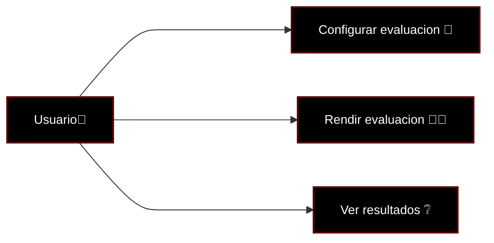

```mermaid
flowchart LR
    customer[Usuario👤]
    action1[Configurar evaluacion 📝]
    action2[Rendir evaluacion ✍🏻]
    action3[Ver resultados ❔]
    
    customer----->action1
    customer----->action2
    customer----->action3

    %% Definir estilo personalizado para los nodos con fondo negro
    classDef customer fill:#000000,stroke:#34a853,stroke-width:2px,font-size:14px,color:#ffffff;
    classDef action1 fill:#000000,stroke:#5C0000,stroke-width:2px,font-size:14px,color:#ffffff;
    classDef action2 fill:#000000,stroke:#5C0000,stroke-width:2px,font-size:14px,color:#ffffff;
    classDef action3 fill:#000000,stroke:#5C0000,stroke-width:2px,font-size:14px,color:#ffffff;
    
    class customer,action1,action2,action3 customStyle;
    
    classDef customStyle fill:#000000,stroke:#5C0000,stroke-width:2px,font-size:14px,color:#ffffff;

```