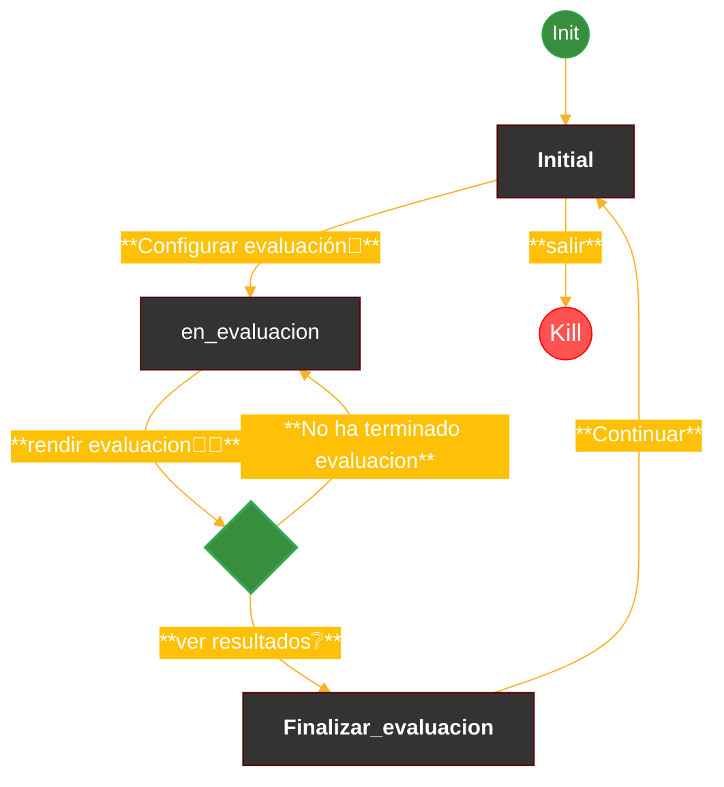

```mermaid
%%{
  init: {
    'theme': 'base',
    'themeVariables': {
      'primaryColor': '#333',
      'primaryBorderColor': '#5C0000',
      'primaryTextColor': '#ffffff',
      'classText': '#5941A9',
      'lineColor': '#F8B229',
      'secondaryColor': '#FFC107',
      'tertiaryColor': '#5C0000'
    }
  }
}%%
flowchart TD
    id1((Init)):::smallGreenCircle --> id2[Initial]
    id2 -->|**Configurar evaluación📝**| en_evaluacion --> |**rendir evaluacion✍🏻**| id3
    id2 --> |**salir**|id4(("Kill")):::smallRedCircle
    id3{ }:::decision
    id3 --> |**No ha terminado evaluacion**| en_evaluacion
    id3 --> |**ver resultados❔**|Finalizar_evaluacion
    Finalizar_evaluacion --> |**Continuar**| id2


    %% Definir estilo personalizado para el círculo (Start)
    classDef smallGreenCircle fill:#388E3C,stroke:#34a853,font-size:15px,radius:20px;
    
    %% Definir estilo personalizado para la caja de decisión (más proporcionada)
    classDef decision fill:#388E3C,stroke:#34a853,stroke-width:2px,font-size:12px,padding:10px;

    %% Definir estilo personalizado para el círculo (End)
    classDef smallRedCircle fill:#FF5252,stroke:#ff0000,font-size:18px,radius:20px;

    %% Estilo para el texto en negrita
    classDef boldText font-weight:bold,color:#5941A9; %% Color para el texto en negrita

    %% Aplicar la clase boldText a las conexiones con texto en negrita
    class id2,id3,Finalizar_evaluacion boldText;


```