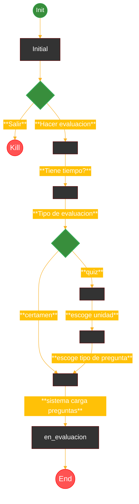

```mermaid
%%{
  init: {
    'theme': 'base',
    'themeVariables': {
      'primaryColor': '#333',
      'primaryBorderColor': '#5C0000',
      'primaryTextColor': '#ffffff',
      'classText': '#5941A9',
      'lineColor': '#F8B229',
      'secondaryColor': '#FFC107',
      'tertiaryColor': '#5C0000'
    }
  }
}%%
flowchart TD
    id1((Init)):::smallGreenCircle --> id2[Initial]
    id9((End)):::smallRedCircle
    id10((Kill)):::smallRedCircle
    id11 --> | **Hacer evaluacion** | id5
    id5 -->|**Tiene tiempo?**| id12
    id11 --> |**Salir**|id10
    id2 --> id11
    id3[ ]
    id4{ }:::decision
    id4 --> |**quiz**| id3
    id4 --> |**certamen**|id7
    id5[ ]
    id6[ ]
    id7[ ]
    id11{ }:::decision
    id12[ ]
    id12[ ] --> | **Tipo de evaluacion** | id4
    id8[en_evaluacion ]
    id3 --> |**escoge unidad**|id6
    id6 --> |**escoge tipo de pregunta**|id7
    id7 --> |**sistema carga preguntas**| id8
    id8 --> id9

    %% Definir estilo personalizado para el círculo (Start)
    classDef smallGreenCircle fill:#388E3C,stroke:#34a853,font-size:15px,radius:20px;
    
    %% Definir estilo personalizado para la caja de decisión (más proporcionada)
    classDef decision fill:#388E3C,stroke:#34a853,stroke-width:2px,font-size:12px,padding:10px;

    %% Definir estilo personalizado para el círculo (End)
    classDef smallRedCircle fill:#FF5252,stroke:#ff0000,font-size:18px,radius:20px;

```