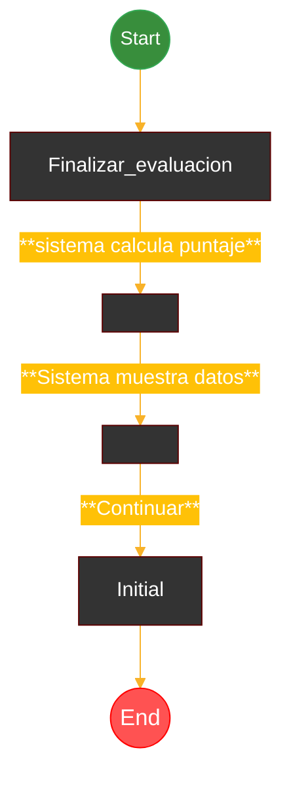

```mermaid
%%{
  init: {
    'theme': 'base',
    'themeVariables': {
      'primaryColor': '#333',
      'primaryBorderColor': '#5C0000',
      'primaryTextColor': '#ffffff',
      'classText': '#5941A9',
      'lineColor': '#F8B229',
      'secondaryColor': '#FFC107',
      'tertiaryColor': '#5C0000'
    }
  }
}%%
flowchart TD
    id1((Start)):::smallGreenCircle --> id2[Finalizar_evaluacion]
    id9((End)):::smallRedCircle
    id3[ ]
    id2 --> |**sistema calcula puntaje**|id3 
    id4[Initial]
    id5[ ]
    id3 --> |**Sistema muestra datos**|id5
    id4 --> id9
    id5 --> |**Continuar**|id4

    
    %% Definir estilo personalizado para el círculo (Start)
    classDef smallGreenCircle fill:#388E3C,stroke:#34a853,font-size:15px,radius:20px;
    
    %% Definir estilo personalizado para la caja de decisión (más proporcionada)
    classDef decision fill:#388E3C,stroke:#34a853,stroke-width:2px,font-size:12px,padding:10px;

    %% Definir estilo personalizado para el círculo (End)
    classDef smallRedCircle fill:#FF5252,stroke:#ff0000,font-size:18px,radius:20px;
```