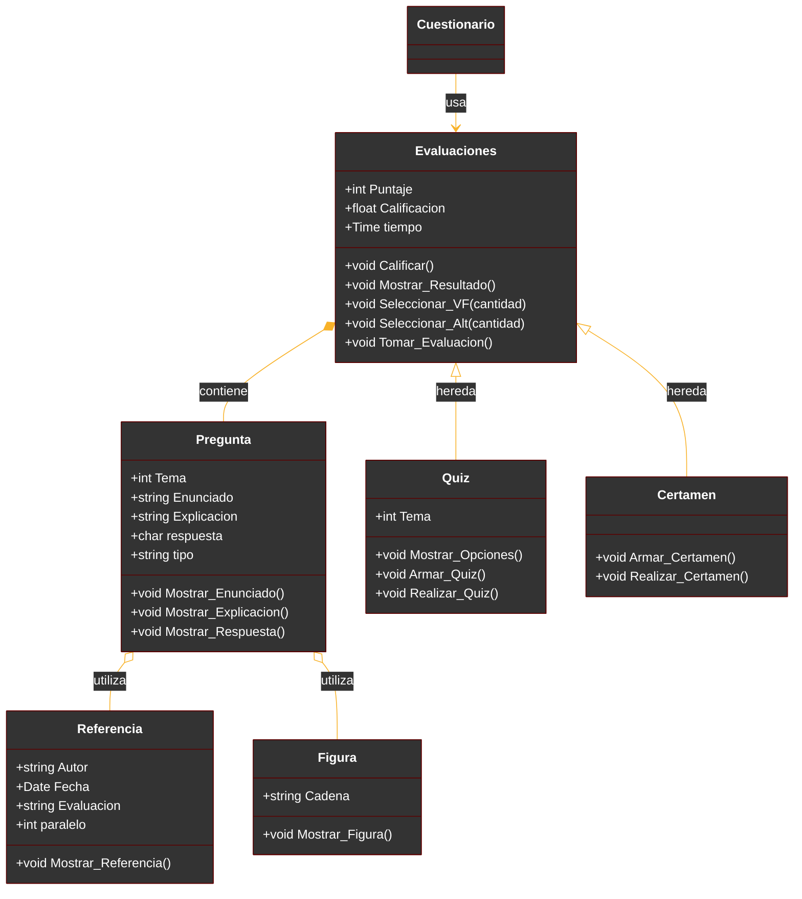

```mermaid
%%{
  init: {
    'theme': 'base',
    'themeVariables': {
      'primaryColor': '#333',
      'primaryBorderColor': '#5C0000',
      'primaryTextColor': '#ffffff',
      'lineColor': '#F8B229',
      'secondaryColor': '#FFC107',
      'tertiaryColor': '#5C0000'
    }
  }
}%%
classDiagram
    Cuestionario --> Evaluaciones : usa
    Evaluaciones *-- Pregunta : contiene
    Pregunta o-- Referencia : utiliza
    Pregunta o-- Figura : utiliza
    Evaluaciones <|-- Quiz : hereda
    Evaluaciones <|-- Certamen : hereda
    class Cuestionario {
    }
    class Evaluaciones {
        +int Puntaje
        +float Calificacion
        +Time tiempo
        +void Calificar()
        +void Mostrar_Resultado()
        +void Seleccionar_VF(cantidad)
        +void Seleccionar_Alt(cantidad)
        +void Tomar_Evaluacion()
    }
    class Pregunta {
        +int Tema
        +string Enunciado
        +string Explicacion
        +char respuesta
        +string tipo
        +void Mostrar_Enunciado()
        +void Mostrar_Explicacion()
        +void Mostrar_Respuesta()
    }
    class Referencia {
        +string Autor
        +Date Fecha
        +string Evaluacion
        +int paralelo
        +void Mostrar_Referencia()
    }
    class Figura {
        +string Cadena
        +void Mostrar_Figura()
    }
    class Quiz {
        +int Tema
        +void Mostrar_Opciones()
        +void Armar_Quiz()
        +void Realizar_Quiz()
    }
    class Certamen {
        +void Armar_Certamen()
        +void Realizar_Certamen()
    }
```